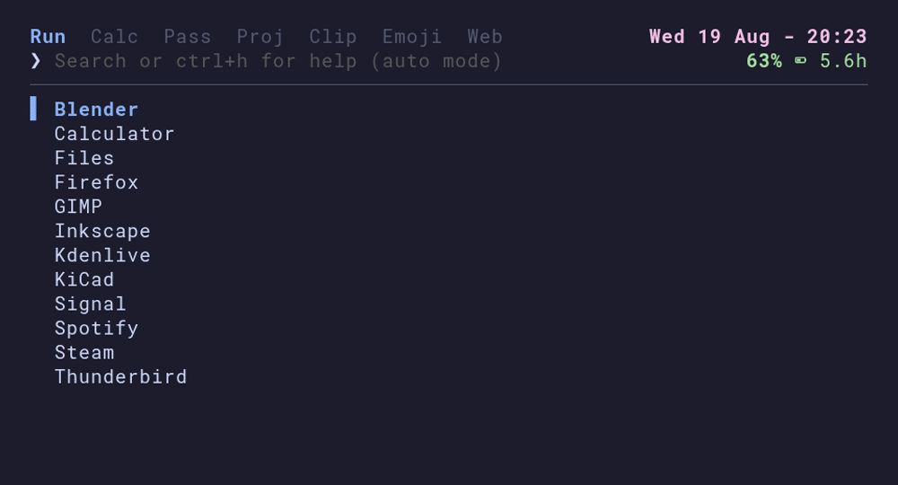

# launtui



A fast, keyboard-driven launcher for the terminal - one search box, with a clock
and battery at a glance. Start typing and it switches to whichever mode fits.

- **Run** - fuzzy-launch your desktop applications
- **Calc** - math (`sqrt`, `pi`, `2^10`), bitwise (`&`, `|`, `<<`, `xor`),
  number-base (`255 to hex`), unit, and currency conversion
- **Pass** - search your [pass](https://www.passwordstore.org) store, copy via GPG
- **Proj** - open a project in your editor, with live git status
- **Clip** - clipboard history
- **Emoji** - emoji picker
- **Web** - open a URL or search the web

Built in Go with [Bubble Tea](https://github.com/charmbracelet/bubbletea) and
[Lip Gloss](https://github.com/charmbracelet/lipgloss).

## Installation

### Nix

_Coming soon._

### Arch Linux (AUR)

_Looking for maintainers._

### From source

1. Clone the repository:

    ```sh
    git clone https://github.com/siliconwitch/launtui.git
    cd launtui
    ```

1. Build the static binary:

    ```sh
    CGO_ENABLED=0 go build -o launtui .
    ```

1. Install it onto your `PATH`:

    ```sh
    sudo install -Dm755 launtui /usr/local/bin/launtui
    ```

## Dependencies

| Feature           | Requires                                                  |
| ----------------- | --------------------------------------------------------- |
| Build from source | [Go](https://go.dev) 1.26+                                |
| Battery icon      | A [Nerd Font](https://www.nerdfonts.com)                  |
| Emoji glyphs      | A colour emoji font (e.g. Noto Color Emoji)               |
| Clipboard         | wl-clipboard (Wayland) or xclip/xsel (X11)                |
| Passwords         | [pass](https://www.passwordstore.org) and gpg             |
| Projects          | git                                                       |
| Web               | xdg-utils (`xdg-open`)                                    |
| Currency rates    | Network access to api.frankfurter.dev (cached for 24 h)   |

## Usage

Run `launtui` in a terminal and start typing. It searches your apps by default
and switches mode automatically when your query fits another one better (e.g.
`4+5` jumps to the calculator, an unmatched question falls back to web search).
`Tab` and `Shift-Tab` step through the modes by hand. In the Calc, Clip and
Web modes, `Del` removes the selected history entry and `Alt-Del` clears that
mode's entire history. Press `Ctrl-h` for the full list of keybindings.

Start directly in a single mode (this turns off the automatic switching):

```sh
launtui -r   # Run
launtui -c   # Calculator
launtui -p   # Passwords
launtui -o   # Projects
launtui -v   # Clipboard
launtui -e   # Emoji
launtui -s   # Web search
```

### Clipboard watcher

The Clip mode records everything launtui itself copies. To also record copies
made anywhere else, keep the watcher running in the background - for example
in your compositor's autostart (sway/niri/hyprland):

```
exec launtui -watch
```

It uses `wl-paste --watch` on Wayland and falls back to polling on X11.
Passwords copied through the Pass mode are recognised and never recorded.

## Config

launtui reads `~/.config/launtui/config.toml` (honouring `$XDG_CONFIG_HOME`,
or an explicit `$LAUNTUI_CONFIG` path). Every key is optional and falls back
to the default below.

```toml
[run]
enabled  = true
exclude  = []                    # app names to hide, exactly as shown in the list
terminal = ""                    # terminal for Terminal=true apps ($TERMINAL or auto-detected)

[calculator]
enabled     = true
precision   = 6                  # max decimal places in the result
max_history = 50                 # calculations kept in history

[passwords]
enabled = true
store   = ""                     # password store path ($PASSWORD_STORE_DIR or ~/.password-store)

[projects]
enabled  = true
dirs     = ["~/Documents"]       # directories scanned for projects
projects = []                    # extra project paths to include explicitly
editor   = ""                    # editor command ($VISUAL or $EDITOR when empty)
terminal = ""                    # terminal for terminal-based editors ($TERMINAL or auto-detected)
# editor_terminal = true         # force terminal vs GUI launch (auto-detected when unset)

[clipboard]
enabled     = true
max_history = 50                 # entries kept in history

[web]
enabled     = true
search_url  = "https://duckduckgo.com/?q=%s"   # %s is the escaped query
max_history = 50                 # visits and searches kept in history

[emoji]
enabled = true

[clock]
enabled = true
format  = "Mon 2 Jan - 15:04"    # Go reference-time layout
zones   = []                     # extra zones: city names ("Tokyo") or IANA ("Asia/Tokyo"), cycle with Ctrl-t

[battery]
enabled = true
device  = "BAT0"                 # name under /sys/class/power_supply

[help]
enabled = true
```

## Contributing

Contributions are welcome - open an issue or a pull request. You're welcome
to contribute with AI assistance too. Just read and test your code before
submitting.

## License

[MIT](LICENSE) © Raj Nakarja
